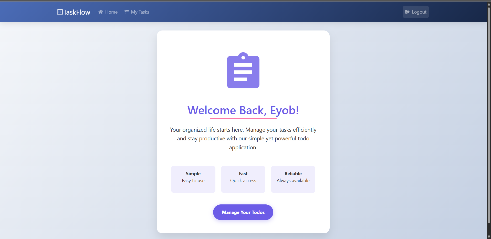
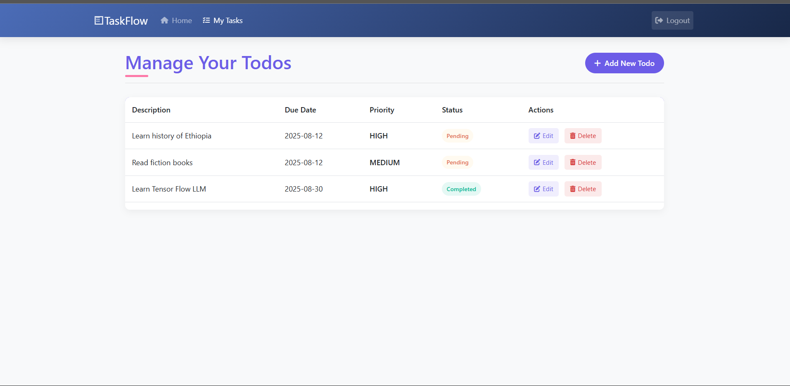
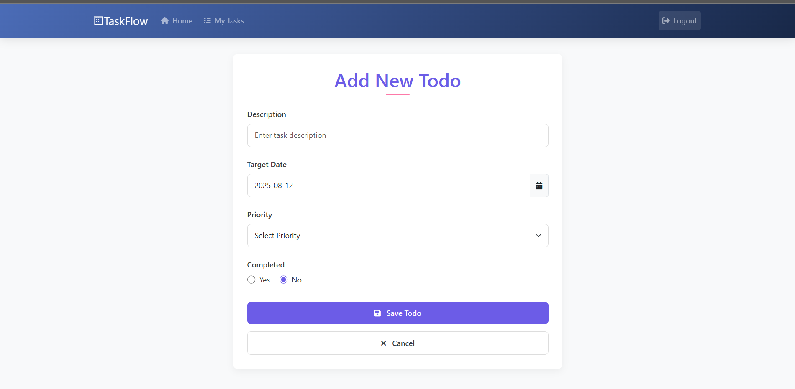

# TaskFlow - Spring Boot Todo Application

<div align="center">



[](https://spring.io/projects/spring-boot)
[](https://www.oracle.com/java/)
[](https://www.postgresql.org/)
[](https://getbootstrap.com/)

*A modern todo management application built with Spring Boot, focusing on robust backend architecture*

</div>

## 📸 Application Screenshots

<div align="center">


*Home Page - User authentication and dashboard*


*Todo Management Interface - CRUD operations display*


*Add/Update Todo Form - Data validation and form handling*

</div>

## 🏗️ Backend Architecture

### Core Technologies
- **Spring Boot 3.5.4** - Main application framework
- **Spring Security** - Authentication and authorization
- **Spring Data JPA** - Database abstraction layer
- **PostgreSQL** - Relational database
- **Maven** - Dependency management and build tool

### Application Layers

#### 1. **Entity Layer** (`Todo.java`)
```java
@Entity
public class Todo {
    @Id
    @GeneratedValue
    private int id;
    
    private String userName;
    
    @Size(min = 10, max = 50, message = "Description must be between 10-50 characters")
    private String description;
    
    @FutureOrPresent(message = "Target date must be present or future")
    private LocalDate targetDate;
    
    private String priority;
    private boolean done;
}
```

#### 2. **Repository Layer** (`TodoRepository.java`)
```java
@Repository
public interface TodoRepository extends JpaRepository<Todo, Integer> {
    List<Todo> findByuserName(String userName);
}
```

#### 3. **Controller Layer** (`TodoController.java`)
- **RESTful endpoints** for todo operations
- **User-specific data filtering** using Spring Security context
- **Form validation** with Bean Validation annotations
- **Model-View-Controller** pattern implementation

#### 4. **Security Layer** (`SecurityConfiguration.java`)
- **In-memory user authentication**
- **BCrypt password encoding**
- **Form-based login**
- **CSRF protection configuration**

## 🔧 Key Backend Features

### Authentication & Security
- Spring Security integration with custom configuration
- User-specific todo isolation
- Secure password handling with BCrypt
- Session management

### Data Persistence
- JPA/Hibernate ORM for database operations
- Custom repository methods for user-specific queries
- Automatic table generation with `hibernate.ddl-auto=update`
- Transaction management

### Validation & Error Handling
- Bean Validation annotations for data integrity
- Custom validation messages
- Form error handling and display
- Input sanitization

### Business Logic
- User-specific todo filtering
- Priority-based task management
- Due date validation (present/future dates only)
- Status tracking (completed/pending)

## 📁 Project Structure

```
src/main/java/com/yobil/TodoApplication/my_springboot_todo_application/
├── controller/
│   └── TodoController.java          # Request handling and routing
├── entity/
│   └── Todo.java                    # JPA entity with validation
├── repository/
│   └── TodoRepository.java          # Data access layer
├── security/
│   └── SecurityConfiguration.java   # Security configuration
└── MySpringbootTodoApplication.java # Main application class
```

## 🗄️ Database Design

### Todo Table Schema
- **id** (Primary Key, Auto-generated)
- **userName** (String) - User identifier
- **description** (String, 10-50 chars) - Task description
- **targetDate** (LocalDate) - Due date validation
- **priority** (String) - Task priority level
- **done** (Boolean) - Completion status

### Key Relationships
- User-to-Todo: One-to-Many relationship
- Repository queries filtered by userName for data isolation

## 🚀 Getting Started

### Prerequisites
- Java 21+
- Maven 3.6+
- PostgreSQL database

### Quick Setup
1. Clone the repository
2. Configure database connection in `application.properties`
3. Run: `./mvnw spring-boot:run`
4. Access: `http://localhost:8080`

## 🧪 Technical Highlights

### Spring Boot Features Used
- **Auto-configuration** for rapid development
- **Starter dependencies** for simplified setup
- **Embedded Tomcat** server
- **DevTools** for development convenience

### JPA/Hibernate Features
- **Entity mapping** with annotations
- **Repository pattern** implementation
- **Custom query methods**
- **Automatic schema generation**

### Security Implementation
- **UserDetailsService** for authentication
- **PasswordEncoder** for secure password handling
- **SecurityFilterChain** for request filtering
- **Authentication context** for user data access

## 🔍 API Endpoints

| Method | Endpoint | Description |
|--------|----------|-------------|
| GET | `/` | Welcome page |
| GET | `/manage-todo` | List user todos |
| GET | `/add-todo` | Show add todo form |
| POST | `/add-todo` | Create new todo |
| GET | `/update` | Show update form |
| POST | `/update` | Update existing todo |
| GET | `/delete` | Delete todo |

## 📊 Performance Considerations

- **Connection pooling** with HikariCP
- **Lazy loading** for JPA entities
- **Indexed queries** on userName field
- **Minimal database calls** with efficient repository methods

## 🔒 Security Measures

- **Input validation** at entity level
- **SQL injection prevention** through JPA
- **XSS protection** with proper output encoding
- **CSRF protection** (configurable)
- **Session management** with Spring Security

---

<div align="center">

**Built with Spring Boot - Focused on Robust Backend Architecture**


</div> 